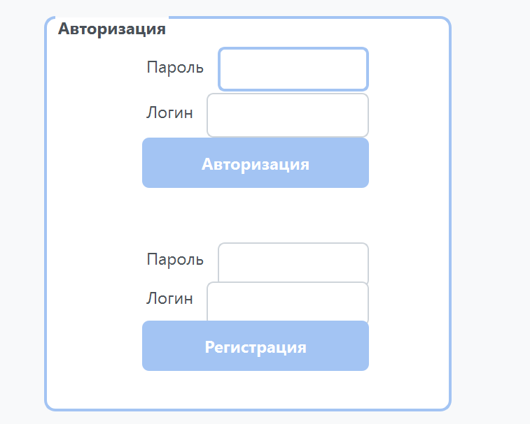
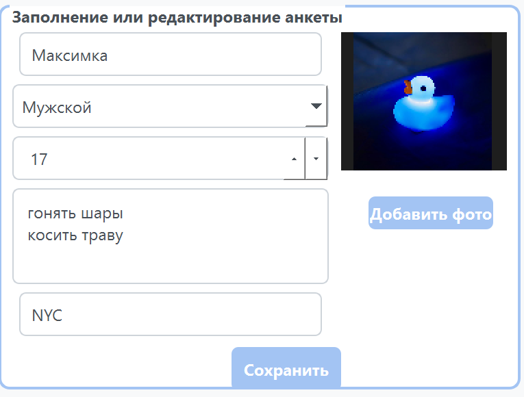
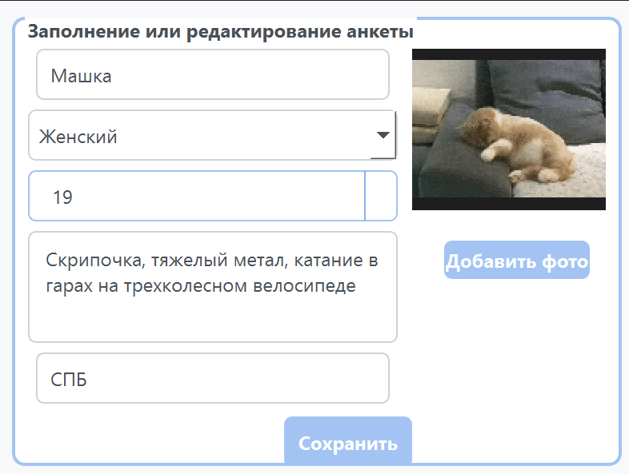
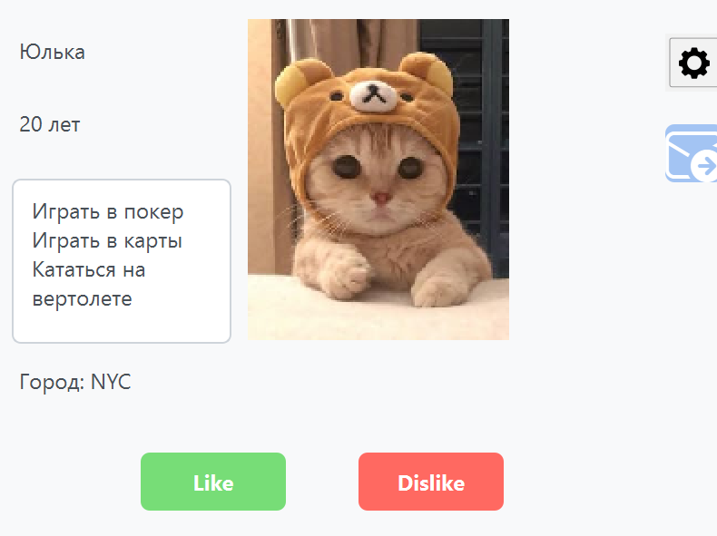
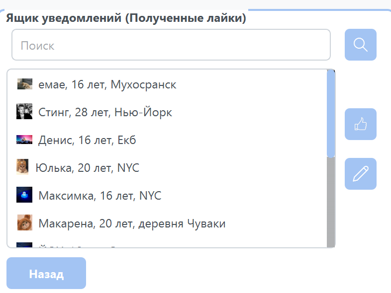
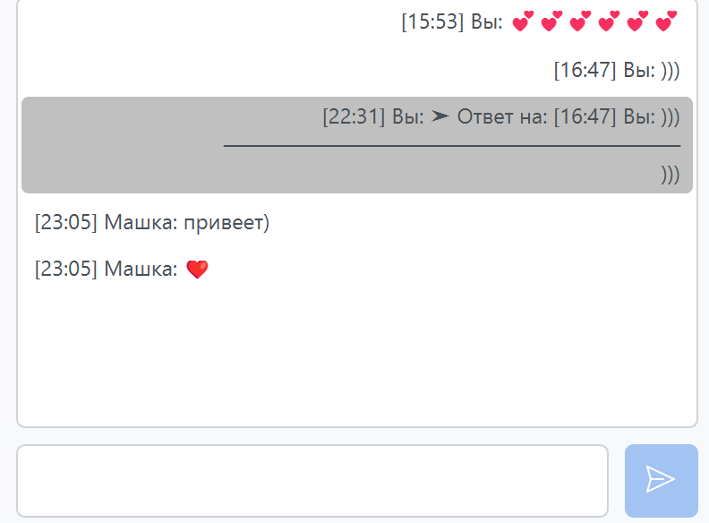
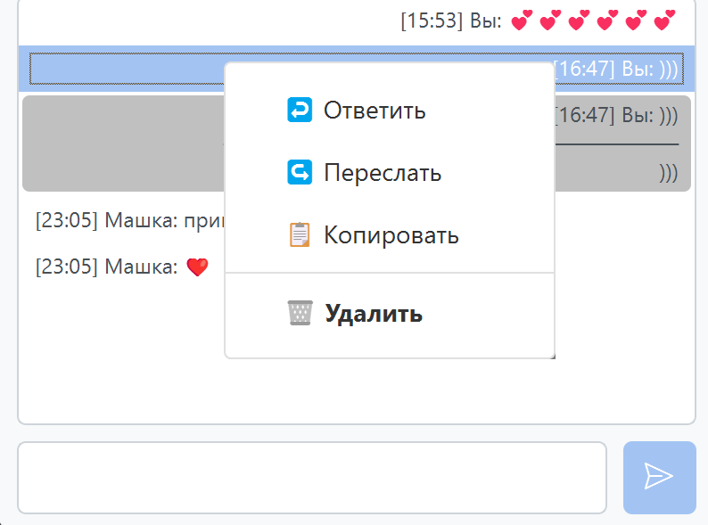

# Flirt Finder

## 📸 Пояснения работы Приложения для знакомств 

###  1. Окно входа или регистрации
Первая страница приложения, которая предлагает пользователю любо войти в аккаунт, либо создать его если его еще нет.

###  2. Заполнение или редактирование пользовательской анкеты
На это окно можно попасть как из первой страницы после входа, так и из страницы просмотра анкет пользователей, перейдя по кнопке настроек. Сдесь можно создать или отредактировать личную анкету пльзователя.

###  3. Просмотр анкет других пользователей в поиске мэтча
Пользователь попадает сюда сразу после входа или после того как создал аккаунт. Сдесь отображаются анкеты других пользователей, которые вы можете оценить, нажав на кнопку лайка или дизлайка. При совпадении реакций лайк возникнет мэтч с другим пользователем и вы сможете перейти в ящик уведомлений и увидеть там этого пользователя.

###  4. Ящик уведомлений
Сюда попадают все пользователи, который поставили вам лайк и можно поставить взаимный лайк прямо в этом меню, так же прямо тут можно посмотреть анкету выбранного пользователя нажав два раза по его имени. Можно найти нужного пользователя в строке поиска, расположенной выше списка пользователей. Также если нажать на пользователя 2 раза, то можно будет увидеть его полную информацию в анкете.

###  5. Личная переписка с пользователем
В это окно можно перейти только если лайк был взаимным с другим пользователем. Здесь ведется личная переписка пользователей. Сюда можно перейти из ящика уведомлений, при взаимном лайке.

###  6. Контекстное меню
Контекстное меню располагается в 5 окне и его можно вызвать с помощью нажатия на правую кнопку мыши любого сообщения. Контекстное меню предлагает различные действия над сообщениями для удобного использования, такие как ответить, переслать, копировать и удалить.

## 🚀 Возможности

- Регистрация и авторизация пользователей
- Заполнение личной анкеты
- Поиск мэтча
- Уведомления
- Поиск пользователей
- Обмен текстовыми сообщениями
- Контекстное меню для сообщений

[📜 **Прочтите пользовательское соглашение перед использованием приложения!**](Пользовательское_соглашение.md)

## 📦 Установка

Раздел еще не готов. Просим дождаться оффициального запуска приложения.